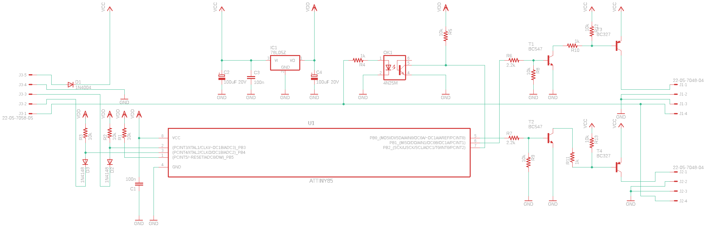
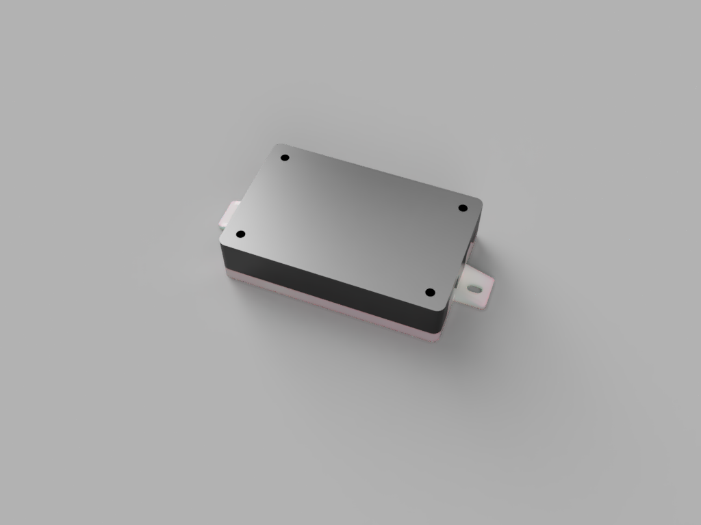

# Footwell Backlight Controller

- Independent two-channel control with smooth fade transitions
- Delayed switch-off feature (can be disabled via T58b input)
- Low power standby mode

## Schematics

## Partlist

### PCB

There are known issues with PCB layout

- Distance between 4p connectors and mounting holes is shorter for 0.5mm
- All connectors have te be moved outside for 3.6mm to match the case outline
- There are errors in J1 and J2 labels positions on the silkscreen - labels are positioned on the solder pads
- D1 is to close to the J3 connector housing

| Qty | Value        | Device        | Package          | Parts                            | Description                                             | MF MPN        | OC_FARNELL | OC_NEWARK | PACKAGE  | SUPPLIER        |
|-----|--------------|---------------|------------------|----------------------------------|---------------------------------------------------------|---------------|------------|-----------|----------|-----------------|
| 2   | 100n         | Capacitor     | C025-025X050     | C1, C3                           | ceramic or polyester capacitor                          |               |            |           |          |                 |
| 2   | 100uF 20V    | Capacitor     | E3,5-8           | C2, C4                           | electrolytic capacitor                                  |               |            |           |          |                 |
| 8   | 10k          | Resistor      | 0207/10          | R1, R2, R3, R5, R8, R9, R12, R13 | 1/4 Watt, ±5%                                           |               |            |           |          |                 |
| 1   | 1N4004       | 1N4004        | DO41-10          | D1                               | DIODE                                                   |               |            |           |          |                 |
| 2   | 1N4148       | 1N4148        | DO35-10          | D2, D3                           | DIODE                                                   |               |            |           |          |                 |
| 3   | 1k           | Resistor      | 0207/10          | R4, R10, R11                     | 1/4 Watt, ±5%                                           |               |            |           |          |                 |
| 2   | 2.2k         | Resistor      | 0207/10          | R6, R7                           | 1/4 Watt, ±5%                                           |               |            |           |          |                 |
| 2   | 5-104935-6   | Connector     | 7395-04          | J1, J2                           | CONNECTOR - LATCHING HDR SHRD 5P W/O HOLD-DN 30AU CNT   | 5-104935-6    |            |           |          | TE Connectivity |
| 1   | 5-104935-6   | Connector     | 7395-05          | J3                               | CONNECTOR - LATCHING HDR SHRD 4P W/O HOLD-DN 30AU CNT   | 5-104935-1    |            |           |          | TE Connectivity |
| 1   | 4N25M        | 4N25M         | DIL06            | OK1                              | General Purpose 6-Pin Phototransistor Optocouplers      | 4N25-M        | 1021349    | 98K9084   |          |                 |
| 1   | 78L05Z       | 78L05Z        | TO92             | IC1                              | Positive VOLTAGE REGULATOR                              |               |            |           |          |                 |
| 1   | ATTINY85     | ATTINY85-20PU | DIP254P762X533-8 | U1                               | 8-bit Microcontroller with In-System Programmable Flash | ATTINY85-20PU | 1455162    | 58M3796   | PDIP-8   | Atmel           |
| 2   | BC327        | BC32725TA     | TO92-EBC         | T3, T4                           | PNP Transistor                                          |               |            |           |          |                 |
| 2   | BC547        | BC547CTA      | TO92-CBE         | T1, T2                           | NPN Transistor                                          |               |            |           |          |                 |

### Wiring

| Qty | Mfr.            | Mfr. No. | Description         |
|-----|-----------------|----------|---------------------|
| 2   | TE Connectivity | 104257-3 | RECEPTACLE ASSY 4P  |
| 1   | TE Connectivity | 104257-4 | RECEPTACLE ASSY 5P  |
| 13  | TE Connectivity | 104479-3 | CONTACT SHORT 24-20 |
| -   |                 |          | 20 AWG wire         |

### Enclosure

M3 treads have to be tapped in bottom part. Assembled with 20xM3 bolts

| Printing method | Material | Color | Layer height | Infill |
|-----------------|----------|-------|--------------|--------|
| FDM             | ABS      | Black | 0.1 mm       | 40%    |

